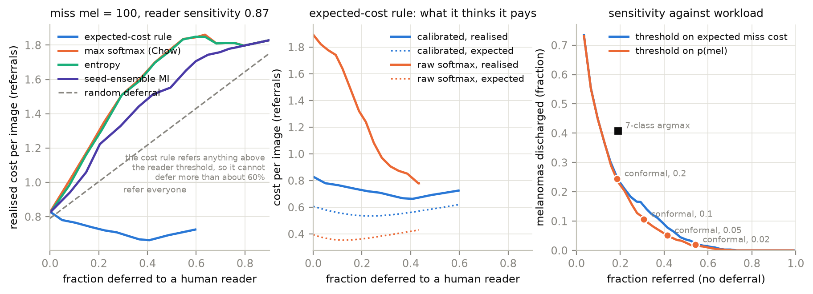

# ham-triage

A skin-lesion classifier that outputs an argmax is not a clinical tool, and on
HAM10000 its headline accuracy is not even a measurement of the classifier. This
repo treats the interesting object as a triage policy instead: posteriors that are
calibrated where the decision is made, prediction sets with a finite-sample
coverage guarantee for the class that matters, and a deferral rule derived from
an explicit cost model with a human reader who is not assumed to be perfect. The
backbone is a stock EfficientNet-B0 from timm and is not the point. Every split is
grouped by `lesion_id`, every number comes with a lesion-clustered bootstrap
interval, and every analysis regenerates from committed logits without training.

## Three numbers

1. **Leakage.** HAM10000 has several images of the same lesion, and a random
   image-level split puts a sibling of 42% of the test images (73% of the
   melanomas) on the training side. Trained on the same 5914 images with only that
   difference and scored on the same 2003 test images, the leaky model is ahead by
   **0.081 [0.045, 0.114] balanced accuracy and 0.125 [0.078, 0.172] melanoma
   recall** (three seeds). On the leaked subset the melanoma-recall gap is 0.184
   [0.129, 0.242]; on the unleaked subset it is -0.04 [-0.11, 0.02]. A naive 80/20
   image split with all 8012 training images reports 0.806 balanced accuracy; the
   lesion-disjoint number is 0.690.
2. **Deferral.** With a missed melanoma costing 100 referrals and a human reader
   at 87% sensitivity, the expected-cost rule at 20% deferral (threshold chosen on
   the calibration split) realises **0.72 [0.60, 0.87] per image and misses 2.3%
   [1.3%, 3.5%] of melanomas**, against 0.83 for never deferring, 1.08 for random
   deferral and 1.51 with 9.9% missed for max-softmax deferral. Max-softmax loses
   to random deferral whenever the reader is imperfect, because it concentrates
   the melanomas in the reader's queue where 13% of them are missed. The same rule
   on uncalibrated posteriors realises 1.01 while expecting 0.38.
3. **Guarantee.** A melanoma-conditional conformal threshold on p(mel) at
   alpha = 0.1 realises **0.893 [0.858, 0.926] sensitivity while flagging 23% of
   non-melanomas**; at alpha = 0.05, 0.949 at 35%. Over 200 lesion-grouped
   re-partitions of the calibration and test images its coverage is 0.907 +/- 0.037
   against the analytic Beta(63, 7) law's 0.900 +/- 0.036, which is the evidence
   that exchangeability holds at the lesion level. The marginal APS set at the
   same alpha covers nv at 0.90 and melanoma at 0.77.



## What else is in here

Temperature scaling on the calibration split brings the temperature to about 2.0
on every seed and NLL from 0.66 to 0.47; the reliability of p(needs treatment) in
the low-probability tail, where the discharge decision actually sits, goes from
7% observed at 0.1% predicted to 0.7% (`results/figures/reliability.png`). The
class-imbalance comparison is made on calibrated posteriors, three seeds each:
subtracting the log training prior from the plain model's logits (Menon et al.
2021) lifts balanced accuracy by 0.037 [0.021, 0.054] and melanoma recall by
0.069 [0.048, 0.093] at zero training cost, while a retrained class-balanced loss
(Cui et al. 2019) gets 0.018 [-0.003, 0.039] and 0.084 [0.050, 0.120]. Both pay
in NLL after temperature scaling, +0.071 and +0.142 [0.059, 0.296] on a base of
0.467, because the posterior is now calibrated to a prior the test population
does not have; the decision layer can multiply in whatever prior it needs, the
loss does not have to. Per-class Mondrian sets are degenerate for df and vasc by arithmetic
(5 and 9 calibration lesions; the quantile index is the sample maximum below 20).
The risk-coverage curve under 0-1 loss is the uniform-cost slice of the frontier;
max softmax has the best AURC (0.039) and the seed-ensemble mutual information
the worst, which is the expected in-distribution null. The cost-model sensitivity
grid in `results/derived/decision.json` sweeps the melanoma miss cost over 10 to
300 and the reader sensitivity over 0.8 to 1.0: the ordering of deferral policies
is stable whenever the reader is imperfect, and the scores tie when the reader is
perfect. A prior-shift scenario with the treated classes five times rarer is in
the same file.

`dx_type` records how each label was established, and across classes it is class
in disguise (every malignant label is histopathology), which is why the planned
experiment on down-weighting low-confidence labels was dropped. Within nv it is
not: histo-nv are nevi that looked suspicious enough to excise, follow_up-nv are
monitored nevi from one device. The triage layer treats them as the different
populations they are: excised nevi get p(mel) of 0.125 [0.112, 0.140], go to a
human 84% of the time and are flagged by the melanoma rule 44% of the time,
against 0.005, 13% and 2% for followed-up nevi, with argmax error rates of 14.5%
and 0.5% (`results/derived/strata.json`). Whether that is the model reading
morphology or reading the MoleMax device is not something HAM10000 can settle.

## Reproduce

```
uv venv .venv --python 3.14
uv pip install --python .venv/Scripts/python.exe -e .
python -m ham_triage.data          # kagglehub download, 256px uint8 cache, ~2 min
python -m ham_triage.splits        # image-level split and the paired audit split
python -m ham_triage.train --split audit --train-col clean_train --seed 0 --run-id clean_s0
python -m ham_triage.train --split audit --train-col leaky_train --seed 0 --run-id leaky_s0
python -m ham_triage.train --split audit --train-col clean_train --loss cb --seed 0 --run-id cb_s0
python -m ham_triage.train --split image_level --seed 0 --run-id naive_s0
python -m ham_triage.analyse       # everything post hoc, from results/runs to results/derived, ~30 s
python -m ham_triage.figures
pytest
```

Seeds 0, 1 and 2 for the first three runs. Each run is about 18 minutes on a GTX
1050 Ti at 224px with fp16 autocast; the logits of every run are committed, so
`analyse` and `figures` work without training. The torch build has to come from
the cu126 index on Windows, which `pyproject.toml` pins.

## Caveats

The audit measures what sibling images of the test lesions do to the score of the
same model on the same images. It does not measure split-to-split variance of the
leakage effect: one test set was drawn, and the three seeds vary only the
initialisation and data order. The clean balanced accuracy of 0.69 is below
published HAM10000 numbers partly because most of those are leaky and partly
because the size-matched design trains on 5914 rather than roughly 8000 images.

The test set was drawn at the image level so that the leaky condition is exactly
what a random split does. That over-samples multi-image lesions, which are
disproportionately melanoma and histopathology-verified excised nevi, so the
calibration and test sets on this fixed split are not exchangeable and the
marginal conformal set under-covers on it (0.864 at alpha = 0.1). The re-partition
histograms show what the same procedure does when both sides are drawn by lesion.
The class-conditional guarantee is immune to that shift; the marginal one is not.

The cost constants are invented. Only the ordering of policies across the
sensitivity grid is a claim; the cost values are not. The reader is modelled as a
fixed sensitivity taken from a reader study, not estimated here, because HAM10000
labels are the reference standard and carry no reader errors to learn from.
HAM10000 is an excision-enriched specialist collection with 11% melanoma by image,
so the operating points do not transfer to a screening population without the
prior shift, and the prior-shift scenario reuses the same test images with
importance weights rather than a real screening sample.

GPU training is seeded but not bitwise reproducible. Bootstrap intervals for ECE
sit high relative to the point estimate because ECE is biased upward on a
resample; NLL and Brier are plain means and are the calibration numbers to trust.
Nothing here was evaluated on images from outside HAM10000; the ISIC 2018 task 3
test set is lesion-disjoint from it and would be the obvious external check.
